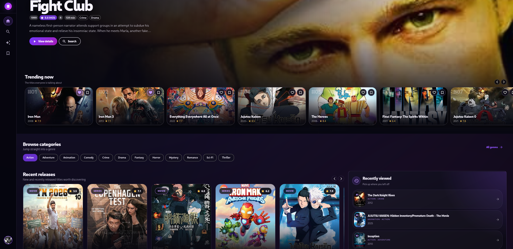
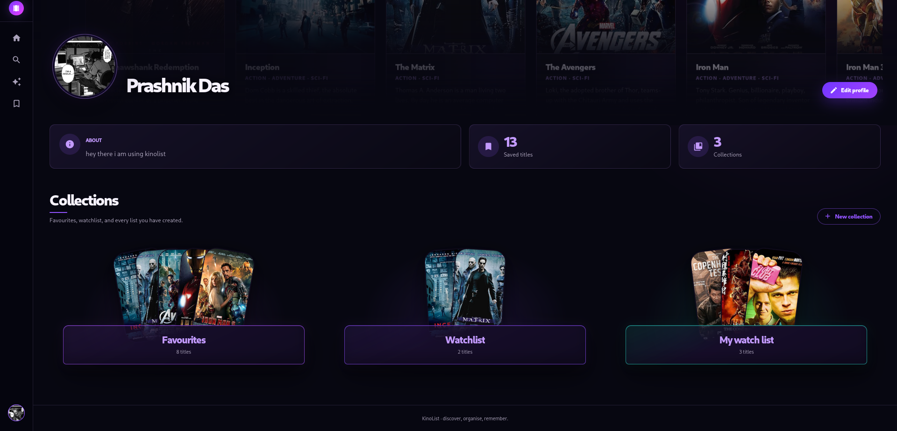
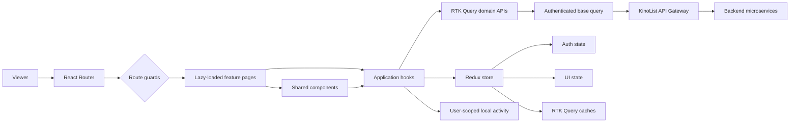
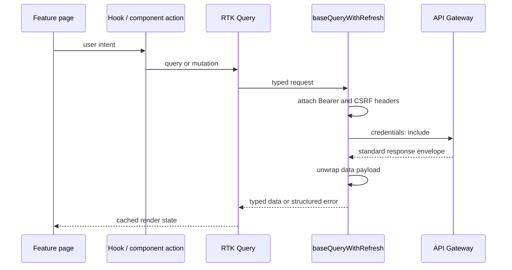
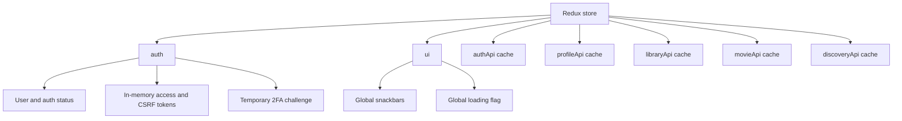
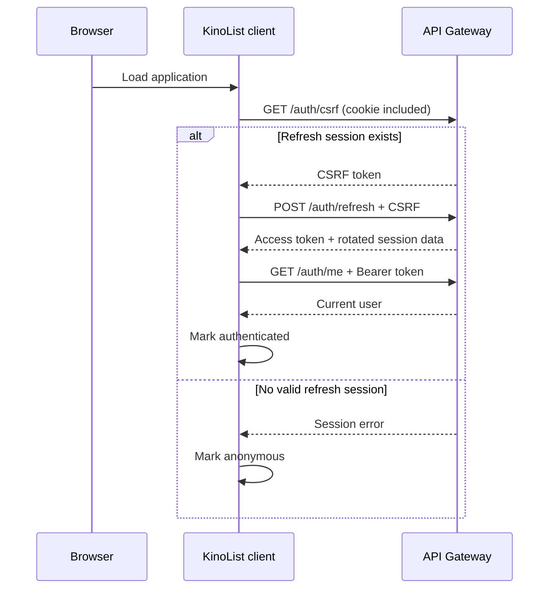
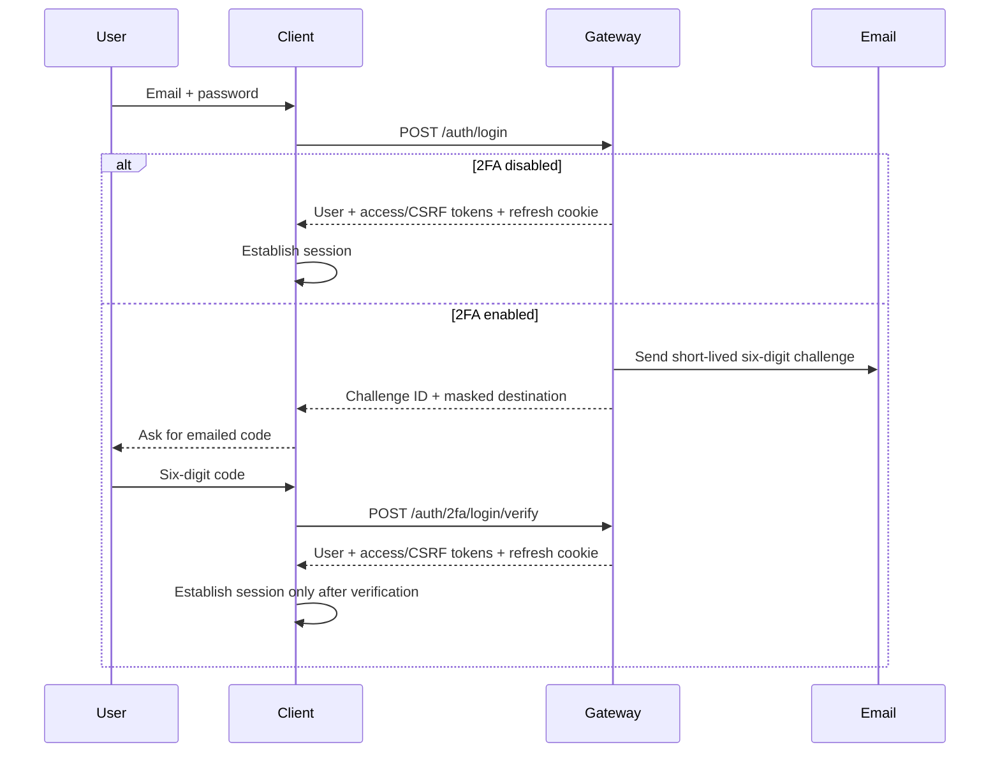

<p align="center">
  
</p>

<h1 align="center">KinoList Client</h1>

<p align="center">
  <strong>A cinematic discovery and collection experience built for people who want to find, organise, and remember what to watch.</strong>
</p>

<p align="center">
  
  
  
  
  
</p>

<p align="center">
  <a href="#product">Product</a> ·
  <a href="#experience">Experience</a> ·
  <a href="#system-design">System design</a> ·
  <a href="#state-design">State design</a> ·
  <a href="#hooks">Hooks</a> ·
  <a href="#security">Security</a> ·
  <a href="#getting-started">Getting started</a>
</p>

---

## Product

KinoList is a personal entertainment product that combines movie discovery, intelligent search, recommendations, and collection management in one coherent experience. It is designed to answer two recurring questions:

1. **What should I watch next?**
2. **Where do I keep everything I want to remember?**

Instead of acting as another static catalogue, KinoList builds continuity around the individual. Searches, viewed titles, favourites, watchlist entries, and custom collections become inputs to a more relevant discovery experience. The result is a product that can sit between content metadata providers and streaming platforms as the user's independent cinema companion.

### Product promise

> Discover naturally. Save instantly. Return without losing context.

| Product pillar | Customer value |
| --- | --- |
| **Discovery** | Browse trending, current, top-rated, genre-specific, and curated titles without starting from a blank search box. |
| **Intelligent search** | Find exact titles with keyword search or describe a mood, story, or style through natural-language AI search. |
| **Personal library** | Maintain favourites, a watchlist, and named custom collections independent of any streaming provider. |
| **Continuity** | Resume from recently viewed and recently searched titles, with activity isolated to the correct account. |
| **Identity** | Build a recognisable profile with a display name, biography, avatar, cover image, and visual collection shelves. |
| **Trust** | Protect the account with short-lived email 2FA, refresh-token rotation, CSRF protection, and session controls. |

### Who it is for

- Film and series fans who use several streaming services but want one durable library.
- Viewers who remember a plot, mood, or actor more easily than an exact title.
- People who curate themed lists for weekends, genres, friends, or future viewing.
- Products that need a polished consumer frontend over a movie-discovery backend.

### Commercial shape

The frontend is structured to support a consumer subscription or freemium product. Its current modules naturally separate into:

- **Acquisition:** public discovery surface, registration, login, and product presentation.
- **Activation:** search, title details, favourite/watchlist actions, and collection creation.
- **Retention:** recent activity, personalised rails, recommendations, and persistent sessions.
- **Account value:** profile identity, media uploads, device management, 2FA, and account controls.

The application deliberately talks only to the KinoList API Gateway. Movie providers, email delivery, media storage, service credentials, and internal service topology remain backend concerns and never leak into the browser configuration.

---

## Experience

### Discovery home

<p align="center">
  
</p>

The home experience is built as a cinematic storefront rather than a conventional dashboard:

- An automatic five-title featured stage.
- A visually prominent trending rail layered beneath the hero.
- Genre shortcuts for fast intent-driven browsing.
- Recent releases beside the five most recently viewed titles.
- Personalised “Because you…” rows derived from recent activity.
- Curated action, adventure, science-fiction, thriller, and animation shelves.
- Rich cards with poster art, rating, genre, plot, year, runtime, and content rating.
- Smooth arrow, pointer-drag, touch, and trackpad navigation across movie rails.

Sections with no usable content remain hidden instead of displaying broken or empty placeholders.

<p align="center">
  
</p>

### Search

KinoList exposes two search modes through one responsive search surface:

| Mode | Behaviour |
| --- | --- |
| **Keyword** | Searches titles directly and supports paginated results. |
| **AI** | Accepts natural-language intent and returns a deliberately bounded result set. |

Typing is debounced before the authenticated AI preview endpoint is called. Up to five suggestions appear below the search control without replacing the existing result grid. Movie/series filtering remains available in both modes, and the most recent resolved searches are shown before a new query is committed.

<p align="center">
  
</p>

### Library and collections

Every account receives two system collections:

- **Favourites** for titles the user loves.
- **Watchlist** for titles the user plans to watch.

Users can create additional named collections from a movie card, the library, or the profile. The library presents each non-empty collection as a horizontal movie rail, while the profile represents collections as compact stacks of up to five posters. Opening a collection leads to its dedicated management view, where items can be removed and custom collection metadata can be edited.

Favourite and save controls use immediate visual feedback. If the server operation fails, the UI rolls back to its previous state and reports the error through the global snackbar system.

<p align="center">
  
</p>

### Profile and account centre

The profile is a visual identity surface with a full-width fading cover, avatar, biography, saved-title summary, and clickable collection stacks. The private email address is intentionally excluded from the public profile presentation.

<p align="center">
  
</p>

Settings consolidate account management into one screen:

- Display name and biography.
- Avatar and cover-image upload with local validation and preview.
- Two-factor authentication setup and reset.
- Active device/session inspection and revocation.
- Logout across every device.
- Permanent account deletion with password confirmation.

<p align="center">
  
</p>

### Responsive navigation

- **Desktop:** a fixed left navigation rail with a compact account menu.
- **Mobile:** a five-position bottom navigation dock with the recommendation action elevated in the centre.
- **Account menu:** profile, settings/security, and logout without a redundant top navigation bar.

---

## Route map

Routes are declared centrally and every page module is lazy-loaded behind a shared suspense boundary.

| Route | Access | Screen responsibility |
| --- | --- | --- |
| `/` | Public; personalised when signed in | Featured discovery, trending, categories, recent activity, and curated rails. |
| `/login` | Anonymous only | Password login and 2FA challenge initiation. |
| `/register` | Anonymous only | Account creation. |
| `/verify-2fa` | Anonymous challenge only | Six-digit email challenge verification. |
| `/search` | Public keyword; authenticated AI | Keyword search, AI search, previews, filters, and search history. |
| `/movie/:imdbId` | Authenticated | Full movie metadata and library actions. |
| `/recommendations` | Authenticated | Last-search, history, favourite, and watchlist recommendations. |
| `/library` | Authenticated | System and custom collection rails. |
| `/library/favourites` | Authenticated | Favourites collection. |
| `/library/watchlist` | Authenticated | Watchlist collection. |
| `/library/playlists/:playlistId` | Authenticated | Custom collection management. |
| `/profile` | Authenticated | Profile identity and visual collection stacks. |
| `/settings` | Authenticated | Profile, security, sessions, and destructive account controls. |

`/settings/security` and `/settings/sessions` are compatibility routes that redirect to the appropriate section of the unified settings screen.

---

## System design

The client uses a feature-oriented React architecture with a strict boundary between rendering, interaction logic, server state, and browser-only activity.



### Design boundaries

| Layer | Owns | Does not own |
| --- | --- | --- |
| `features/` | Page composition, route-specific state, and screen workflows. | Generic data transport or cross-screen infrastructure. |
| `components/` | Reusable layout, movie presentation, feedback, and interaction primitives. | Page-specific fetching policy. |
| `hooks/` | Reusable orchestration and browser behaviour. | Markup-heavy screen presentation. |
| `api/` | Backend contracts, endpoint definitions, caching tags, and transport policy. | Long-lived UI state. |
| `store/` | Session identity, global feedback, and API cache registration. | Form drafts or component-local interactions. |
| `lib/` | Constants, error classifications, and storage helpers. | React rendering. |

### Request path



The client never calls individual service ports or internal routes. Its only browser-facing backend dependency is:

```text
${VITE_API_BASE_URL} → http://localhost:5000/api/v1 by default
```

---

## State design

KinoList distinguishes between credentials, global UI state, server state, and browser-local behavioural data. This prevents a single oversized store from becoming the owner of everything.

### Store topology



### Ownership table

| State | Owner | Persistence | Reason |
| --- | --- | --- | --- |
| Authentication status | `authSlice` | Memory | Route guards need a single source of truth. |
| Authenticated user | `authSlice` | Memory | Identifies the active account without persisting private credentials. |
| Access token | `authSlice` | Memory only | Reduces exposure to persistent browser storage. |
| CSRF token | `authSlice` | Memory only | Added centrally to eligible writes. |
| Refresh token | Browser HttpOnly cookie | Cookie lifetime | Unavailable to JavaScript by design. |
| 2FA challenge | `authSlice` | Memory only | Short-lived transitional login state. |
| Toasts/loading | `uiSlice` | Memory | Cross-route feedback without URL coupling. |
| Profiles, movies, feeds, playlists | RTK Query | Memory cache | Normalised transport behaviour, deduplication, tags, and refetching. |
| Form fields and dialogs | Local component state | Component lifetime | Keeps transient UI close to its owner. |
| Recent activity | User-scoped `localStorage` | Configurable TTL | Enables continuity without placing credentials in storage. |

### Account boundaries

RTK Query retains fulfilled responses after a component unmounts. KinoList therefore includes account-boundary middleware that resets every API cache when:

- The current user logs out.
- A different authenticated user replaces the existing identity.

This prevents a second account from briefly rendering the previous account's profile, library, search results, or recommendations.

Recent activity is also namespaced:

```text
kinolist.user.<encoded-user-id>.recentActivity
kinolist.guest.recentActivity
```

The old unscoped storage key is deleted rather than assigned to an account, because ownership cannot be established safely.

### Server-cache strategy

Five RTK Query slices divide the backend by domain:

| Slice | Responsibility | Primary cache tags |
| --- | --- | --- |
| `authApi` | Login, registration, current identity, CSRF, refresh, 2FA, sessions, logout, deletion. | `Auth`, `Sessions` |
| `profileApi` | Private profile retrieval, profile lookup, and multipart profile updates. | `Profile` |
| `libraryApi` | System collections, custom playlists, item membership, and summary counts. | `Playlists`, `Summary` |
| `movieApi` | Full movie metadata by IMDb identifier. | `Movie` |
| `discoveryApi` | Keyword/AI search, feeds, genres, and recommendation channels. | Query cache by arguments |

Mutations invalidate only the domains that can become stale. Reusable library actions add toast feedback and recent-activity recording around those mutations.

---

## Hooks

Hooks form the application-service layer between pages/components and infrastructure.

| Hook | Responsibility | Important behaviour |
| --- | --- | --- |
| `useAuth` | Reads the current authentication state. | Exposes `status`, `user`, and `isAuthenticated` without leaking store structure. |
| `useSessionBootstrap` | Restores a refresh-cookie session when the application mounts. | Performs CSRF → refresh → current-user recovery once and prevents route flashing. |
| `useCountdown` | Produces a live number of seconds until expiry. | Used by short-lived 2FA challenges. |
| `useDebounce` | Delays a changing value until typing settles. | Protects AI suggestions from firing on every keystroke. |
| `usePageMeta` | Synchronises the document title with the current page. | Gives each lazy route meaningful browser metadata. |
| `usePlaylistActions` | Orchestrates playlist creation, item addition, and item removal. | Converts movie DTOs to saved snapshots, emits feedback, and records activity. |
| `useRecentActivity` | Reads and writes account-scoped browser activity. | Supports TTL filtering, deduplication, same-tab updates, and cross-tab storage events. |
| `useRecentActivitySections` | Converts activity into personalised homepage sections. | Avoids recommending titles already owned in favourites or watchlist. |

### Hook design rules

1. Hooks expose intent-oriented APIs rather than raw Redux actions.
2. Network requests remain inside RTK Query endpoint hooks.
3. Browser storage is accessed through one library module.
4. Hooks do not render presentation-heavy markup.
5. Components retain local ownership of drafts, menus, dialogs, and optimistic visual overrides.

---

## Component design

### Shared movie system

`MovieCard` is the canonical title presentation component. It changes its action region according to context instead of creating separate card implementations:

- Normal discovery surfaces show favourite and save controls.
- Collection routes show a remove action.
- Missing summary fields are hydrated only when the card approaches the viewport.
- Poster failures fall back to a stable visual placeholder.

`MovieRail` owns horizontal navigation:

- Arrow navigation when overflow exists and at least five items are available.
- Mouse dragging with momentum.
- Native touch/trackpad scrolling.
- Hidden scrollbars.
- Deferred rendering for off-screen rows.
- Optional removal context for library pages.
- No output for empty or failed sections when configured to hide them.

`MovieGrid` owns full collection/search layouts and reuses the same card contract.

### Feedback and state components

- `PageSkeleton` and specialised skeletons preserve layout while lazy chunks and data load.
- `LoadingState`, `ErrorState`, and `EmptyState` provide consistent asynchronous states.
- `SnackbarHost` renders global success, information, warning, and error feedback.
- `ConfirmDialog` standardises destructive confirmation flows.
- `PageHeader` standardises screen titles and contextual actions.

### Styling system

Material UI and Emotion are the primary component and theme layer. The visual system is defined centrally through:

- Deep ink backgrounds.
- Violet primary actions.
- Magenta accent gradients.
- High-contrast cinema typography.
- Rounded surfaces and controls.
- Consistent card, dialog, input, chip, skeleton, and button overrides.
- Responsive `sx` breakpoints and MUI `Grid2` layouts.

Tailwind is available in the build pipeline for utilities, but the current product interface is predominantly driven by MUI theme tokens and component-level `sx` styling.

---

## Security

### Session bootstrap

The access token is intentionally not persisted. A returning session is reconstructed from the protected refresh cookie:



### Login and email 2FA



### Refresh behaviour

The shared base query handles an expired access token centrally:

1. Classify the structured backend error code.
2. Ignore terminal errors that require re-authentication.
3. Deduplicate concurrent refresh attempts with one module-level promise.
4. Rotate the session through `/auth/refresh`.
5. Replay the original request once.
6. Clear local authentication if refresh fails.

### Browser security rules

- Never place API keys, SMTP credentials, media credentials, or service tokens in `VITE_*` variables.
- Never persist access or CSRF tokens in local or session storage.
- Always send browser requests through the API Gateway.
- Keep `credentials: 'include'` enabled for refresh-cookie workflows.
- Validate profile media type and size before upload; enforce the same rules again on the backend.
- Treat display name, biography, and images as public profile data; keep account email private outside account controls.

---

## API integration

All successful gateway responses are unwrapped from the standard envelope before reaching page components:

```json
{
  "success": true,
  "data": {},
  "meta": {},
  "requestId": "..."
}
```

Errors remain structured:

```json
{
  "success": false,
  "error": {
    "code": "ERROR_CODE",
    "message": "Human-readable message",
    "details": []
  },
  "requestId": "..."
}
```

### Browser-facing domains

| Domain | Gateway paths consumed by the client |
| --- | --- |
| Authentication | `/auth/csrf`, `/auth/refresh`, `/auth/register`, `/auth/login`, `/auth/me`, `/auth/logout`, `/auth/logout-all`, `/auth/sessions/*`, `/auth/2fa/*`, `/auth/account` |
| Profile | `/user/me`, `/user/:id`, `/user/update` |
| Library | `/library/playlists/*`, `/library/favourites`, `/library/watchlist`, `/library/summary` |
| Movies | `/movie/:imdbId` |
| Discovery | `/search`, `/search/ai`, `/feed/*`, `/recommend/*` |

The frontend contract uses `imdbId`; the library add-item request maps it to the backend's `imdbID` field at the API boundary.

---

## Repository layout

```text
kinolist_client/
├── .github/
│   └── assets/readme/       # Tracked README presentation assets
├── public/                  # Favicon and crawler-facing static files
├── src/
│   ├── api/                 # RTK Query slices, transport wrapper, DTOs
│   ├── components/
│   │   ├── layout/          # Responsive shell and navigation
│   │   ├── movie/           # Canonical card, grid, rail, library actions
│   │   ├── state/           # Loading, error, empty, and not-found states
│   │   └── ui/              # Shared dialogs, headers, and snackbars
│   ├── features/
│   │   ├── auth/            # Login, registration, and 2FA verification
│   │   ├── home/            # Discovery storefront
│   │   ├── library/         # Library and collection management
│   │   ├── movie/           # Movie detail experience
│   │   ├── profile/         # Identity and collection stacks
│   │   ├── recommend/       # Personal recommendation channels
│   │   ├── search/          # Keyword, AI, preview, and recent search
│   │   └── settings/        # Profile, 2FA, sessions, account deletion
│   ├── hooks/               # Application orchestration hooks
│   ├── lib/                 # Constants, errors, and activity storage
│   ├── store/               # Redux slices, middleware, API registration
│   ├── styles/              # Theme and global styles
│   ├── main.tsx             # Application providers and root render
│   └── router.tsx           # Lazy routes and authentication guards
├── .env.example             # Public browser configuration template
├── index.html               # HTML shell and resource hints
├── package.json
├── tsconfig.json
└── vite.config.ts           # React plugin and production chunk strategy
```

---

## Getting started

### Prerequisites

- Node.js 20 or newer.
- npm 10 or newer.
- KinoList API Gateway available at `http://localhost:5000` by default.
- The backend services required by the Gateway.

### Install

```bash
git clone <your-repository-url>
cd kinolist_client
npm install
cp .env.example .env
```

### Configure

The default local configuration is ready for a Gateway running on port `5000`:

```dotenv
VITE_API_BASE_URL=http://localhost:5000/api/v1
VITE_APP_NAME=KinoList
VITE_AI_SEARCH_HARD_LIMIT=5
VITE_IMAGE_MAX_BYTES=5242880
VITE_RECENT_ACTIVITY_CAP=10
VITE_RECENT_ACTIVITY_TTL_DAYS=30
VITE_RECENT_SECTIONS_MAX=4
```

> [!CAUTION]
> Vite embeds every `VITE_*` value into browser-accessible JavaScript. These variables are configuration, not secrets.

### Develop

```bash
npm run dev
```

Open `http://localhost:5173`.

### Type-check

```bash
npm run typecheck
```

### Build and serve the production bundle

```bash
npm run build
npm run preview
```

The compiled application is written to `dist/`. Preview uses `localhost:5173` in strict-port mode, so it fails clearly if the development server still owns that port.

---

## Environment variables

| Variable | Default | Description |
| --- | --- | --- |
| `VITE_API_BASE_URL` | `http://localhost:5000/api/v1` | Public base URL of the KinoList API Gateway. |
| `VITE_APP_NAME` | `KinoList` | Product name used by browser metadata and shared UI. |
| `VITE_AI_SEARCH_HARD_LIMIT` | `5` | Maximum number of AI preview suggestions requested while typing. |
| `VITE_IMAGE_MAX_BYTES` | `5242880` | Client-side avatar/cover upload limit in bytes. |
| `VITE_RECENT_ACTIVITY_CAP` | `10` | Maximum recent activity events retained for each user. |
| `VITE_RECENT_ACTIVITY_TTL_DAYS` | `30` | Number of days browser-local activity remains relevant. |
| `VITE_RECENT_SECTIONS_MAX` | `4` | Maximum number of activity-generated homepage rows. |

Changing an environment value requires rebuilding the production bundle.

---


## Deployment contract

KinoList is a client-side routed single-page application. A production host must:

1. Serve the contents of `dist/`.
2. Rewrite unknown application paths to `index.html`.
3. Use HTTPS outside local development.
4. Configure the backend CORS allowlist with the exact frontend origin.
5. Configure refresh-cookie security and `SameSite` behaviour for the chosen frontend/API topology.
6. Set `VITE_API_BASE_URL` to the public API Gateway URL before building.

Example SPA fallback concept:

```text
/assets/*     → serve static asset
/*            → /index.html
```

Do not proxy browser traffic directly to individual microservices. The API Gateway is the browser-facing trust boundary.

---

## Product principles

KinoList is developed around five durable principles:

1. **One visual language.** The same movie, collection, feedback, and navigation primitives should feel consistent everywhere.
2. **Immediate interaction.** Favourite and save actions acknowledge intent immediately and roll back honestly on failure.
3. **Private by default.** Credentials remain out of persistent JavaScript storage, account caches do not cross identities, and private account data stays out of public surfaces.
4. **Useful emptiness.** If a rail has no meaningful content, it does not consume the interface with an empty box.
5. **The Gateway is the contract.** The frontend understands product domains, not internal microservice topology.

<p align="center">
  <strong>KinoList</strong><br />
  <sub>Discover what to watch. Organise what matters. Remember every title.</sub>
</p>
